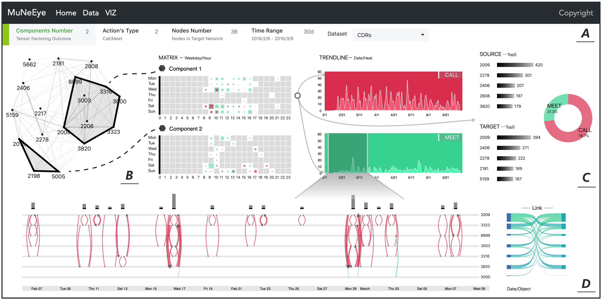

# Tensor_vis
The source code of the paper "Latent Patterns Detection and Interpretation in Multi-Layer Temporal Network"

> In this project, we proposed a compatible MLTN encoding method for converting diverse MLTNs into tensors. Next, based on the tensor factoring technique, a tensor can be factored to main components to help us obtain the main interaction patterns in MLTN. However, the factoring result is hard to understand. Therefore, we built an MLTN visual analytic system called MuNeEye to help system users understand the factoring result of MLTN and further explore the latent patterns of MLTN.
